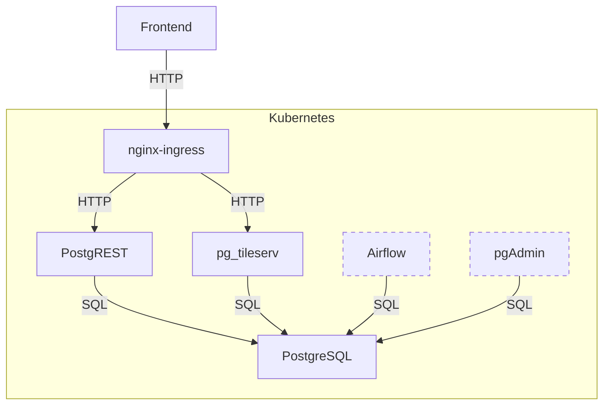

# OSM BästaJävlaKartan

BästaJävlaKartan (or BJK, or OSM-BJK, for short, Swedish for best fucking map) is a tool that compares OpenStreetMap data against various open data sources from Sweden, and reports and deviations it finds.

  <a href="https://wiki.openstreetmap.org/wiki/B%C3%A4staJ%C3%A4vlaKartan">Documentation</a> - <a href="https://osm-bjk.jandal.se/">Live site</a>

## Screenshots

## Architecture

BJK consist of four main components:

- A database (PostgreSQL with PostGIS)
- An Apache Airflow instance with several DAGs for fetching data and calculating deviations
- Two database-to-API-proxies (one for REST and one for vector tiles)
- A web frontend

The database contains one schema with OSM data, using a relatively "raw" table structure (comparable to that of the OSM main database but without history) which is synced using replication in one of the Airflow DAGs, currently once every 10 minutes. That DAG also calculates PostGIS geometries which are also stored in the database in the same tables.

A second schema in the database contains data from various upstream sources, which are also synced using Airflow DAGs.

A third schema contains the deviations and other metadata that is made available over the API.

A relatively large amount of the business logic is implemented in SQL. For example, deviations are calculated purely using SQL right now, the DAGs to recalculate them just call into SQL.

## Installation & Contributing

Setting up the full BJK from scratch is a significant undertaking, and the initial loading of data can take several days depending on your hardware specs. However, it is still possible to contribute to some parts of it with just a limited setup, especially the frontend.

### Frontend (changing how the deviations are presented to the user)

This one is easy, and you're even provided with a [devcontainer](https://containers.dev/) for convenience. However, the manual steps are as follows:

1. Prerequisites: Node.js with NPM
2. Clone this repo
3. Go into the [`frontend`](https://github.com/02JanDal/osm-bjk/tree/main/frontend) folder
4. Run `npm install`
5. Run `npm run dev`
6. Visit [`http://localhost:5137/`](http://localhost:5137/) in your browser

### Database (changing how deviations are calculated, adding deviation calculation for a new dataset)

A little harder, depending on what you want to do. Get started by:

1. Prerequisites: Docker, Python
2. Clone this repo
3. Go into the [`database`](https://github.com/02JanDal/osm-bjk/tree/main/database) folder
4. Run `pip install -r requirements.txt`
5. Run `python db.py watch`

You can now edit any of the files in the [`database/migrations`](https://github.com/02JanDal/osm-bjk/tree/main/database/migrations) or [`database/tests`](https://github.com/02JanDal/osm-bjk/tree/main/database/tests) folder, and they will automatically be applied and tested in an ephemeral Docker container.

For just adjusting small parts this might be enough, however, if you want to add deviation calculation for an entirely new dataset or a similar change you'll need the data. If the data is already being fetched (see [Datasets](https://osm-bjk.jandal.se/datasets)) you can ask in an issue for a database extract to work with, otherwise, you'll first have to add the fetching code (or ask for it to be added in an issue), see below.

### DAGs (changing how data is fetched, adding a new dataset)

This is the most involved, and this section is likely to be incomplete (please file an issue if you find something that's incorrectly described here!).
You essentially have two options; you can either install a Kubernetes environment (I recommend using `kind` or `microk8s`) or run Airflow "locally".

Once you have Airflow running, you can start editing the DAGs in [`dags`](https://github.com/02JanDal/osm-bjk/tree/main/dags). See the existing dags for how this should be done.
